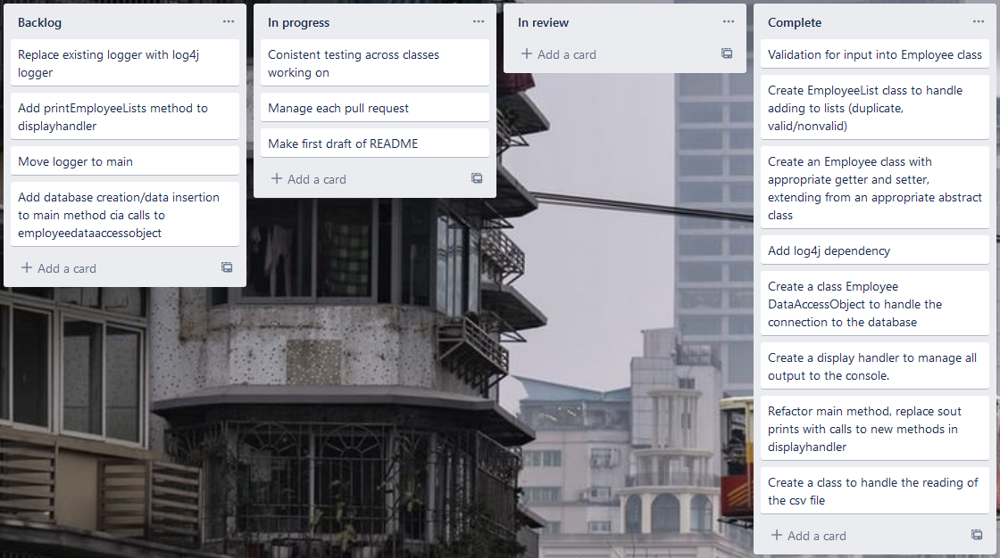

# Employee CSV
***a program for converting a .csv of employee data to a mysql database***

## Contents
- [CSV Format](readme.md#csv-format)
- [Using the program](readme.md#using-the-program)
- [Technologies used](readme.md#technologies-used)
- [Scrum Process](readme.md#scrum-process)

## CSV Format
The program expects CSV files with records in the following format:

|Emp ID|Name Prefix|First Name|Middle Initial|Last Name|Gender|E-Mail|Date of Birth|Date of Joining|Salary
|---|---|---|---|---|---|---|---|---|---|
|198429|Mrs.|Serafina|I|Bumgarner|F|serafina.bumgarner@exxonmobil.com|9/21/1982|2/1/2008|69294|
|178566|Mrs.|Juliette|M|Rojo|F|juliette.rojo@yahoo.co.uk|5/8/1967|6/4/2011|193912|
|647173|Mr.|Milan|F|Krawczyk|M|milan.krawczyk@hotmail.com|4/4/1980|1/19/2012|123681|
|847634|Mr.|Elmer|R|Jason|M|elmer.jason@yahoo.com|4/9/1996|5/28/2017|93504|
|...|...|...|...|...|...|...|...|...|...|

The file *can* have a header, but the first entry in the header row must be `Emp ID` exactly.

## Using the program
When the program starts, the user will be prompted to enter a file path of a csv for the program to read from.
> Please enter a file path: 

While reading the file, the program will indicate if any records are invalid and print them to the console.
> The following record is not a valid employee: 

Each record that can be successfully read will be added to a different table in the output database:
- Valid records will be added to the main table.
- Valid duplicate records will be added to their own table.
- Records with valid formatting but invalid values will be added to their own table of "questionable" records.

Records that are valid in format but have questionable values will be added to 

## Technologies used
The following technologies & libraries were used in the creation of this software:
- JetBrains IntelliJ Ultimate
- GitHub
- JUnit 5 Jupiter
- Apache Log4j 2

## Scrum Process
Autumn Pelešová was the Scrum Master, and was responsible for organizing scrums and delegating development responsibility among the group for each sprint
Andy Murray created and maintained the Trello board.
For an example of how we used Trello for our scrum development, here is a screenshot from Thursday afternoon:
